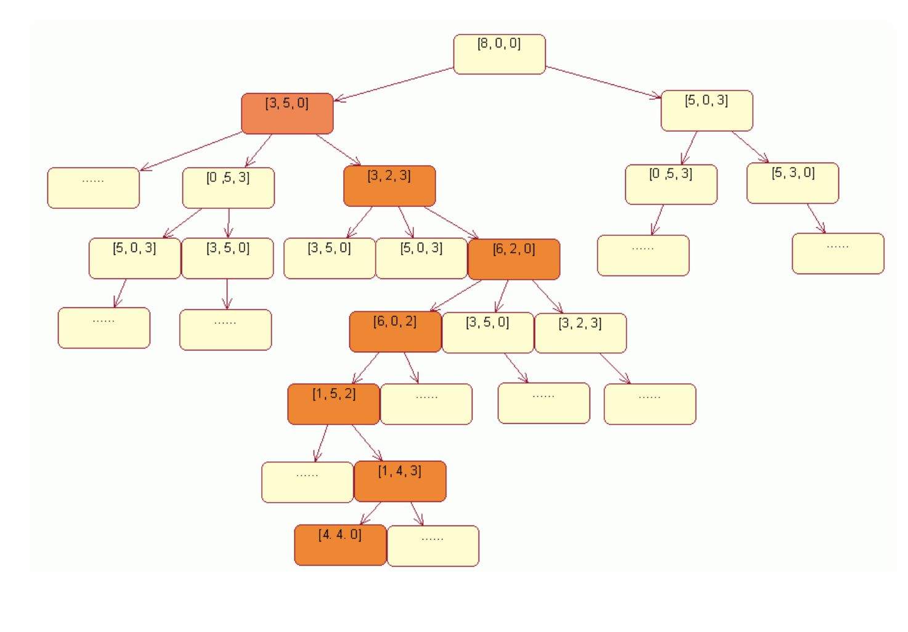

# 算法之：三只水桶分水问题

    有一个容积为8升的水桶里装满了水，另外还有一个容积为3升的空桶和一个容积为5升的空桶，如何将水等分到8，5升桶中？附加条件是三个水桶都没有刻度，也不能使用其他辅助容器


建立状态和动作的数学模型

> 使用一组一维向量描述水桶的容积状态量。初始量为{8，0，0}，终止状态为{4，4，0}
> 使用一个一维数组描述倒水动作 ：{from， to, water}。from：表示水从哪里来，to:水倒往何处.water:表示倒水量。


倒水动作三元组

```
struct Action
{
    int from;
    int to;
    int water;
}
```


状态模型
```
struct BucketState
{
    .......
    int bucket_s[buckets_count];
    Action curAction;
};
```


状态树搜索法




文章出处 [算法系列之二：三只水桶等分水问题](http://blog.csdn.net/orbit/article/details/6596521)